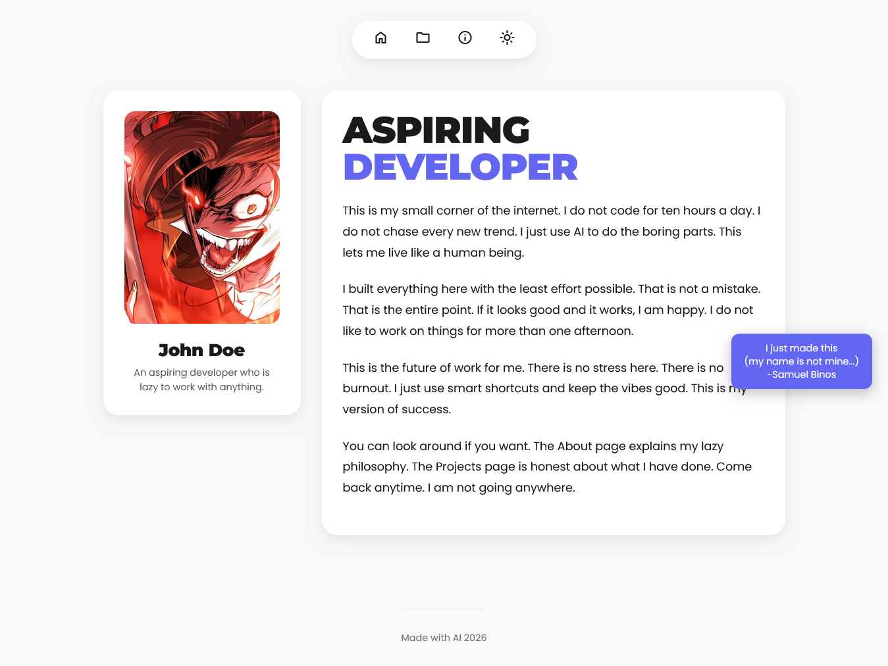
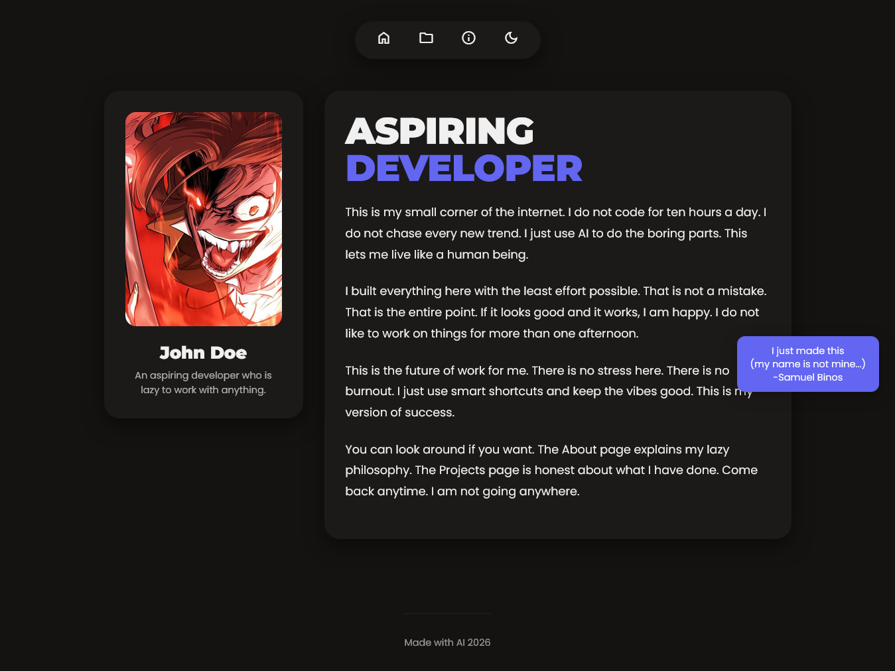
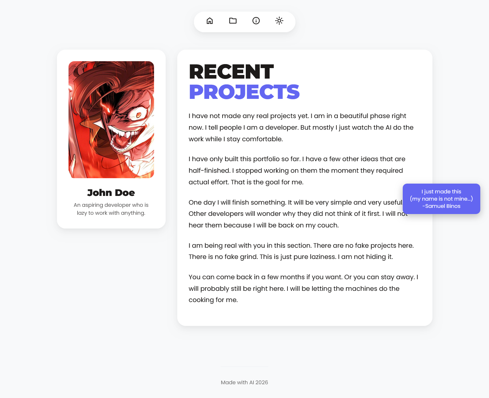
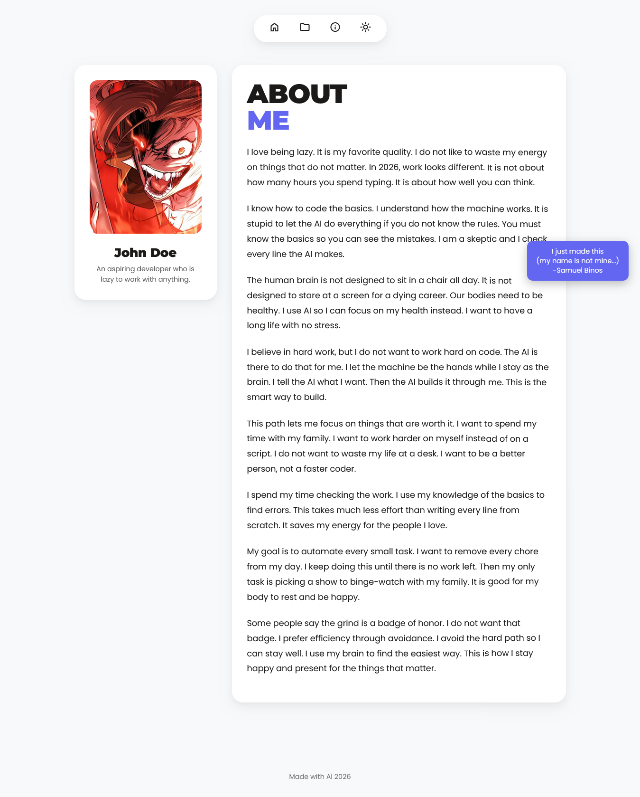
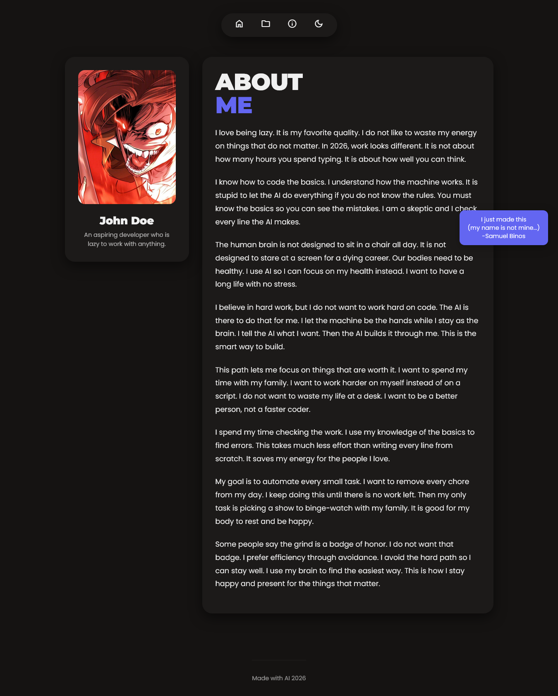

# Laboratory 3: Laravel Pages, Controllers, and Routes

### Project Description
A personal portfolio application built with Laravel featuring three distinct pages: Home, Projects, and About. This project demonstrates the implementation of independent controllers, routing, and Blade templates.

### Screenshots

#### 1. Home Page
* **Light Mode:** 
* **Dark Mode:** 

#### 2. Projects Page
* **Light Mode:** 
* **Dark Mode:** 

#### 3. About Page
* **Light Mode:** 
* **Dark Mode:** 

---

## Prerequisites
- PHP 8.1+
- Composer
- Git

## How to Run Locally

### ⚠️ CAUTION (Windows Users)

**Command Prompt/PowerShell opens in System32 by default!**

Before running any commands, navigate to where you actually want the project:

```bash
# Example: Navigate to your Documents or desired folder first
cd C:\Users\YourUsername\Documents
# or
cd C:\Users\YourUsername\Desktop
# or wherever you want your project
```

**DO NOT clone into System32 (C:\Windows\System32)** - that's a system directory and will cause permission issues!

---

### Step-by-Step

**1. Clone the repository**
```bash
git clone https://github.com/xoptech/Laboratory-3-Laravel-Pages-Controllers-and-Routes.git
cd Laboratory-3-Laravel-Pages-Controllers-and-Routes
```

**2. Install dependencies**
```bash
composer install
```

**3. Setup environment**

Linux/Mac:
```bash
cp .env.example .env
```

Windows:
```bash
copy .env.example .env
```

**4. Generate app key**
```bash
php artisan key:generate
```

**5. Create database**

Windows (PowerShell):
```bash
New-Item database\database.sqlite -ItemType File
php artisan migrate
```

Windows (CMD):
```bash
copy nul database\database.sqlite
php artisan migrate
```

Linux/Mac:
```bash
touch database/database.sqlite
php artisan migrate
```

**6. Start the server**
```bash
php artisan serve
```

**7. Visit:** http://localhost:8000

### One-Liner (Copy-Paste All)

**Linux/Mac:**
~~~bash
git clone https://github.com/xoptech/Laboratory-3-Laravel-Pages-Controllers-and-Routes.git && cd Laboratory-3-Laravel-Pages-Controllers-and-Routes && composer install && cp .env.example .env && php artisan key:generate && touch database/database.sqlite && php artisan migrate && php artisan serve
~~~

**Windows (Command Prompt):**
~~~bash
git clone https://github.com/xoptech/Laboratory-3-Laravel-Pages-Controllers-and-Routes.git && cd Laboratory-3-Laravel-Pages-Controllers-and-Routes && composer install && copy .env.example .env && php artisan key:generate && copy nul database\database.sqlite && php artisan migrate && php artisan serve
~~~

**Windows (PowerShell):**
~~~bash
git clone https://github.com/xoptech/Laboratory-3-Laravel-Pages-Controllers-and-Routes.git; cd Laboratory-3-Laravel-Pages-Controllers-and-Routes; composer install; copy .env.example .env; php artisan key:generate; New-Item database\database.sqlite -ItemType File; php artisan migrate; php artisan serve
~~~